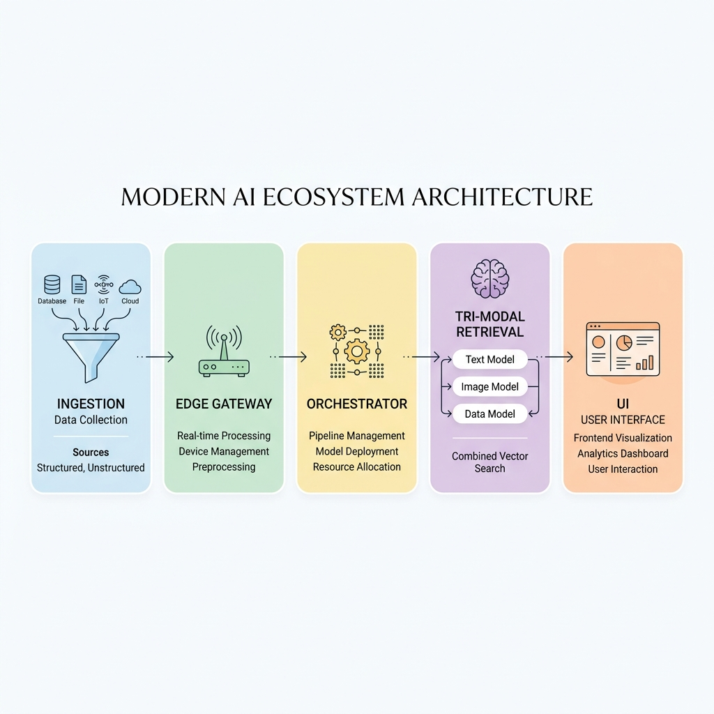

# BIMRAG Ecosystem

**A State-of-the-Art, Model-Agnostic Deep Research and Retrieval Platform**



## Meta-repo and submodules

This directory is the **BIMRAG meta-repo**. Backend code lives in `bimrag-backend/`; the UI lives in `BIMWeb/`.

```bash
# Fresh clone
git clone --recurse-submodules https://github.com/ashishpatill/Retrieval_workspace.git
cd Retrieval_workspace

# Existing clone: init submodules
git submodule update --init --recursive

# Move submodules to recorded commits after pull
git pull
git submodule update --init --recursive
```

| Submodule | Repository |
|-----------|------------|
| `bimrag-backend` | BIMAgent, BIMCloud, BIMExtract, BIMIndex (consolidated) |
| `BIMWeb` | Next.js UI |

Legacy individual backend repos remain on GitHub for history; day-to-day development uses `bimrag-backend/services/*`.


## Quick Start — One Command

First-time dev setup (Python venvs per backend service + BIMWeb `pnpm install`):

```bash
./setup-dev.sh
```

```bash
# Start all 5 services (BIMIndex, BIMExtract, BIMAgent, BIMCloud, BIMWeb)
./start-platform.sh

# Start + seed sample data + run all end-to-end scenarios
./start-platform.sh --demo

# Other commands
./start-platform.sh --stop      # stop the platform
./start-platform.sh --status    # show service status
```

All services boot, health-check, and print a status table with URLs. `Ctrl+C` gracefully shuts everything down. Logs stream to `logs/<service>.log`.

### Services & Ports

| Service | Port | Role | API Docs |
|---------|------|------|----------|
| BIMAgent | 8000 | Central orchestrator → BIMIndex + BIMExtract | http://localhost:8000/docs |
| BIMIndex | 8001 | Tri-modal retrieval (Tantivy/LanceDB/KuzuDB + RRF) | http://localhost:8001/docs |
| BIMCloud | 8080 | Edge gateway → BIMAgent + Prometheus metrics | http://localhost:8080/docs |
| BIMExtract | 8200 | Ingestion pipeline + SLT/LGAP + SuperRAG + Auto-RAG + MDocAgent | http://localhost:8200/docs |
| BIMWeb | 3000 | Next.js UI (search + deployments dashboards) | http://localhost:3000 |

### Run Scenarios

```bash
./run-scenarios.sh --seed                # seed BIMIndex with sample documents
./run-scenarios.sh                       # run all 26 end-to-end checks
./run-scenarios.sh <name>                # run one scenario
```

Available scenarios: `index-search` `extract-pipeline` `parsers` `graph` `auto-rag` `mdoc` `agent` `cloud` `web` `all`

### End-to-End Flows

1. **Search** (BIMWeb → BIMAgent → BIMIndex): UI `Ask Agent` tab → orchestrator dispatches BIMIndex skill → tri-modal search → grounded synthesized answer.
2. **Direct Index** (BIMWeb → BIMIndex): UI `Direct Index` tab → `/search/{vectorless,dense,graph}`.
3. **Gateway** (BIMWeb → BIMCloud → BIMAgent): Deployments UI → `/query` with circuit breaker + trace + Prometheus `/metrics`.
4. **Ingestion** (BIMAgent → BIMExtract): `/pipeline/{ingest,page-index,enrich}` async jobs with status polling.
5. **Research modules** (BIMExtract): SLT/LGAP parse, SuperRAG graph build+search, Auto-RAG classify+fallback, MDocAgent 4-agent fuse.

## The Research Breakthrough

Months of rigorous academic and applied research revealed a critical flaw in traditional Retrieval-Augmented Generation (RAG): relying on a single vector database or proprietary document parsing pipelines inevitably leads to "lost in the middle" errors, context degradation, and exorbitant costs at enterprise scale.

The **BIMRAG Ecosystem** was engineered to solve the most challenging problems in document extraction, structural retrieval, and AI orchestration. Our breakthrough is a highly efficient, **model-agnostic stack** that empowers *any* local model to perform at an enterprise level. We decoupled the intelligence from the proprietary APIs, building an orchestrator and retrieval engine that is faster, vastly cheaper, and structurally aware.

## The Tri-Modal Retrieval Architecture
Instead of relying on a single vector space, our platform leverages a proprietary **Tri-Modal Retrieval** mechanism. This ensures that no critical piece of information—whether a subtle keyword, a dense semantic concept, or a multi-hop relationship—is ever missed.

- **Dense Pathway**: Multi-vector routing optimized for semantic understanding.
- **Lexical Pathway**: Deterministic inverted index matching ensuring "needle in a haystack" accuracy.
- **Graph Pathway**: Advanced relation mapping preserving complex structural layouts and hierarchies.

These modalities are fused autonomously by our Central Agentic Orchestrator, resulting in a system capable of answering profound, multi-hop research queries instantly.

## Ecosystem Components

1. **[BIMExtract](BIMExtract/) (Document Ingestion Agent)**: Our proprietary ingestion moat. It effortlessly converts the messiest, most complex documents (handwritten notes, dense financial tables, heavy mathematics) into perfectly structured, context-enriched data blocks. 
2. **[BIMIndex](BIMIndex/) (Tri-Modal Retrieval Agent)**: The heart of our search capabilities, dynamically routing queries across three distinct indices (Dense, Lexical, Graph) and synthesizing the results with Reciprocal Rank Fusion.
3. **[BIMAgent](BIMAgent/) (Central Orchestrator Agent)**: The cognitive mastermind of the ecosystem. It decomposes complex user tasks, tracks deep research goals, and seamlessly marshals the other sub-agents.
4. **[BIMCloud](BIMCloud/) (Edge Gateway Agent)**: The enterprise gateway responsible for real-time telemetry, continuous evaluation, and usage metering.
5. **[BIMWeb](BIMWeb/) (User Interface)**: The convergence point. A highly interactive WebGL 3D environment and collaborative dashboard where users experience the full power of the BIMRAG ecosystem.

## Why It Matters
By combining Tri-Modal Retrieval with intelligent Agentic Preprocessing, we have fundamentally altered the economics and accuracy ceilings of document intelligence. 
This stack guarantees **state-of-the-art accuracy** on the most challenging layouts while maintaining extreme cost efficiency, running entirely independent of vendor lock-in.

---
*Built for scale, engineered for precision, designed for the future.*
### CI

- **Meta-repo:** `.github/workflows/ecosystem-e2e.yml` runs Playwright platform API tests with `submodules: recursive` and root `docker compose`.
- **Meta-repo:** `.github/workflows/deploy.yml` path-filtered unified deploy (`./deploy.sh`) on submodule pointer changes.
- **BIMWeb-only:** `BIMWeb/.github/workflows/cd.yml` deploys to Vercel on push to `main`.
- **BIMWeb-only:** `BIMWeb/.github/workflows/playwright.yml` `ecosystem` job expects a monorepo checkout; use the meta-repo workflow for full-stack CI.

See [docs/environments.md](docs/environments.md) for production vs sandbox configuration.

